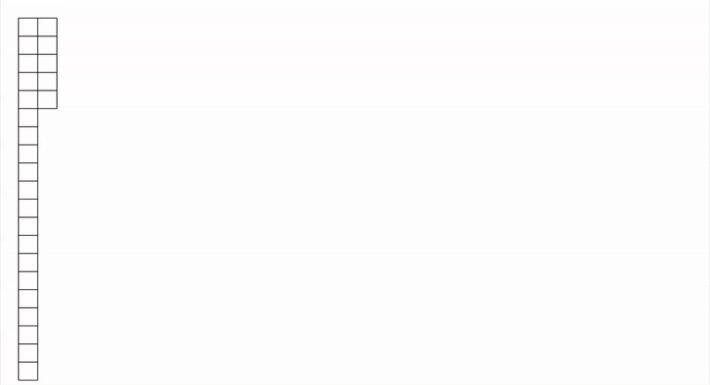
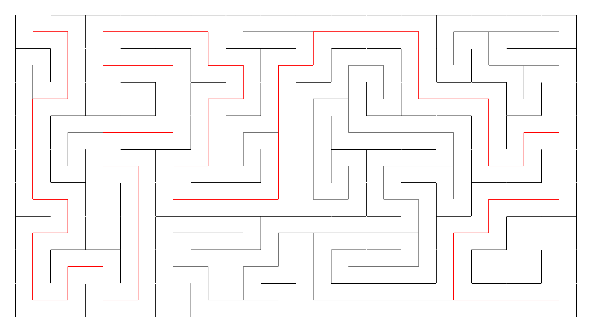
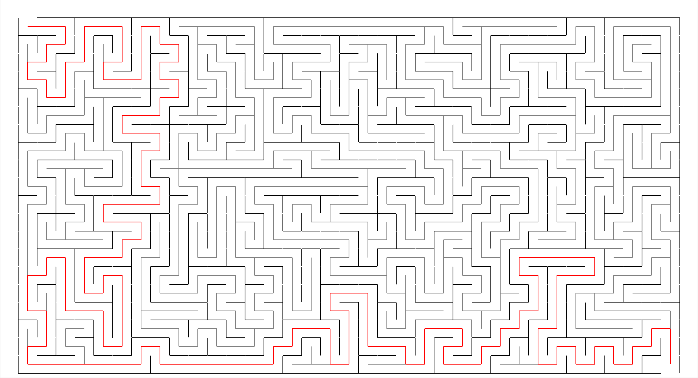
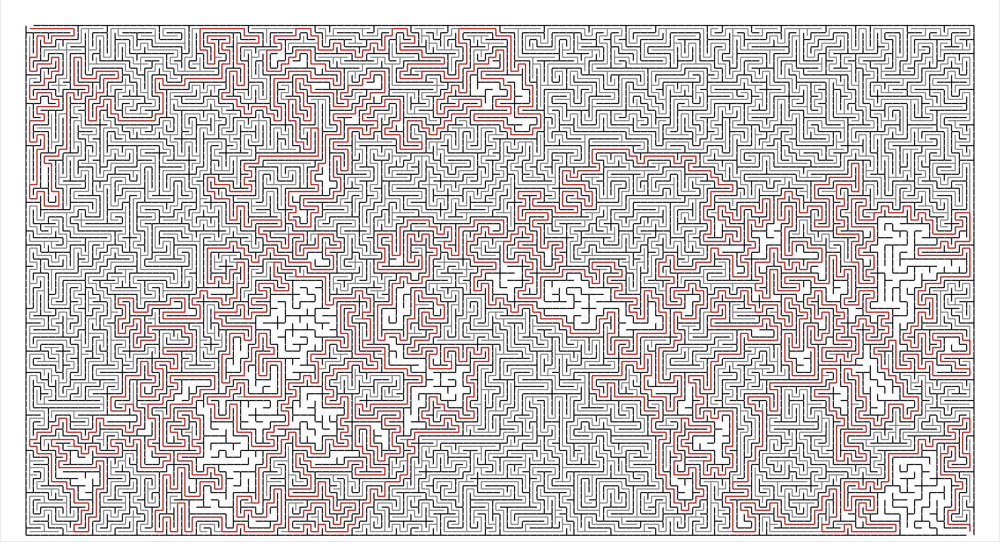

# maze-solver

A simple maze creation and solving program.

The program uses recursion for both the creation and solving phase.

The maze gets solved using a Depth-first approach.

## Examples

Demonstration of maze generation and its solution process.

An example of a small solved Maze with 16 columns and 9 rows.

An example of a medium solved Maze with 35 columns and 20 rows.

An example of a big solved Maze with 128 columns and 72 rows.

## TO-DO

- [ ] Finish the README file
- [ ] Create a formula for the time.sleep function based on the number of total cells
- [ ] Add other solving algorithms, like breadth-first search or A*
- [ ] Make the visuals prettier, change the colors, etc
- [ ] Mess with the animation settings to make it faster/slower. Maybe make backtracking slow and blazing new paths faster?
- [ ] Add configurations in the app itself using Tkinter buttons and inputs to allow users to change maze size, speed, etc
- [ ] Make much larger mazes to solve
- [ ] Make it a game where the user chooses directions
- [ ] If you made it a game, allow the user to race an algorithm
- [ ] Make it 3-dimensional
- [ ] Time the various algorithms and see which ones are the fastest
